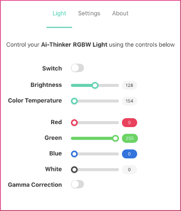
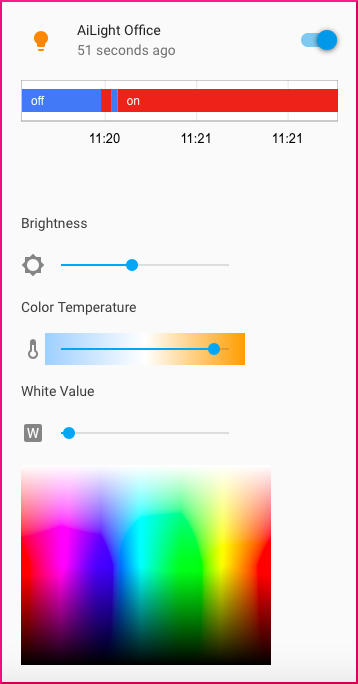

The AiLight firmware includes a nice feature that allows you to set the colour temperature of your Ai-Thinker LED RGBW light.

## What is Colour Temperature?
A way to think of the colour temperature is how 'warm' or 'cool' the white LED light is. Colour temperature is measured in degrees Kelvin and is a measure of the part of the color spectrum that is found in light.

> The human eye is excellent at adjusting to different colour temperatures, which means that to you and me objects appear roughly the same colour whether they're outside in the sun or indoors under a lightbulb.
(Source: <http://www.photographymad.com/pages/view/what-is-colour-temperature>)

## How to use
Setting the colour temperature of your Ai-Thinker LED RGBW light can be done in 3 different ways:

### 1. AiLight Web UI
To set the colour temperature, simply move the colour temperature slider to the desired value.



### 2. Home Assistant
For setting the temperature in Home Assistant, it is assumed the appropriate configuration in Home Assistant is done. Click on your light's icon to have the configuration panel opened. Next, simply move the colour temperature slider to the desired value.



### 3. Using MQTT
You can alternatively set the colour temperature by publishing an MQTT message to your Ai-Thinker LED RGBW light. To do that, simply send a JSON message to the MQTT Command Topic set for your Ai-Thinker LED RGBW light.

Example:
``` JSON
{"state":"ON","color_temp":370}
```

This will turn on your Ai-Thinker LED RGBW light with a colour temperature of about 2700K (370 mired ~ 2700K).

Note: The values for colour temperature are expressed in mired, micro reciprocal degree. Possible values range from 153 - 500 mired (See: <https://en.wikipedia.org/wiki/Mired>)
