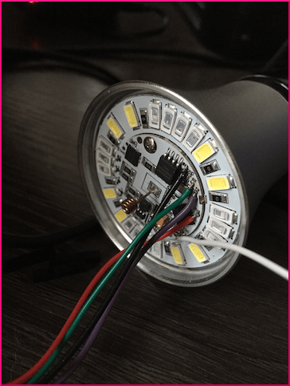

To be able to upload firmware to your Ai-Thinker LED RGBW light, a connection from your PC to the light must be made. The inner PCB of the light has 5 PCB pads labelled **3V3**, **GND**, **RX**, **TX** and **IO0**. These were most likely used at the factory to flash the factory firmware.

How do we then make such a connection? There are two ways:

## Wires
Solder wires to the 5 PCB pads and connect these wires to your USB/UART (or equivalent) adapter. Xose Pérez has written an excellent [article](http://tinkerman.cat/ailight-hackable-rgbw-light-bulb/) on his blog how you can make such a connection, and upload your own firmware.

## Use an AiLight Jig
The [AiLight Jig](https://www.sachatelgenhof.nl/blog/ailight-jig) is designed specifically for the Ai-Thinker LED RGBW light and allows for uploading custom firmware without soldering. And, if you have more than one Ai-Thinker LED RGBW light, you can use the jig over and over, saving you a lot of hassle!

_If you'd like to use an AiLight Jig, check out more details [here](https://www.sachatelgenhof.nl/blog/ailight-jig). For those who have tinkering skills, follow [[these|Make-your-own-AiLight-Jig]] instructions how to make your own AiLight jig._

### Using the AiLight Jig
_!**Warning**: Please make sure your Ai-Thinker LED RGBW light is **not** connected to your mains while connecting your USB/UART (or equivalent) adapter or AiLight Jig._

1. Before flashing any firmware, please install the CP210x USB to UART driver for your OS first. You can find the drivers and instructions here: [https://www.silabs.com/products/development-tools/software/usb-to-uart-bridge-vcp-drivers](https://www.silabs.com/products/development-tools/software/usb-to-uart-bridge-vcp-drivers)
2. Remove the white, plastic cover from your Ai-Thinker LED RGBW light.
3. Position the assembled Jig on top of the PCB that now is visible. Be careful not to bend or break the antenna in the middle of the PCB.
4. Align the Jig in such a way that the bottom tips of the pogo pins align with the PCB contact points (GND, RX, TX, etc.). You may need to rotate the Jig until you find the right position.
5. Press the Jig down so it fits tightly in the aluminum body of the Ai-Thinker LED RGBW light. Please note that it may take some force to press it in. Due to the natural properties of wood, the jig size might have been slightly increased / decreased (humidity, temperature, etc.)
6. Attach a Micro USB to USB cable to the adapter and your computer.

Everything is now ready to [[flash|Flashing-the-Firmware]] the firmware!

In case you have noticed that you’re no able to flash the firmware, check above steps again to make sure the pogo pins are properly touching the PCB contacts.
