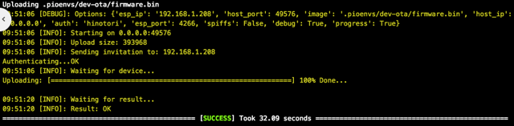

Having your Ai-Thinker RGBW Light run using the **AiLight** firmware is quite simple and consists only of two parts:
1. Compiling the firmware
2. Flashing (i.e uploading) the firmware.

_Before starting, please make sure you have all that is [[needed|Requirements]]._

## Compiling the firmware

1. Clone this **AiLight** repository (or download a Zip file) and change your current directory to where **AiLight** is cloned (or where you unpacked the Zip file).
2. Make a copy of the `config.example.h` file in the 'src' folder named `config.h`
   Depending on your environment, set at least the following values in the `config.h` file:

  - WIFI_SSID `// Your WiFi SSID`
  - WIFI_PSK `// Your WiFi PSK/Password`
  - MQTT_SERVER `// The hostname/IP address of your MQTT broker`
  - MQTT_USER `// The username to connect to your MQTT broker`
  - MQTT_PASSWORD `// The password to connect to your MQTT broker`

  Leaving the WiFi values blank, will make the **AiLight** start in AP mode (Access Point). From there you can access the settings screen and enter your WiFi settings. (TBD)

  Other configuration variables can be left as is, however, feel free to adjust as you see fit.

3. Make a copy of the `platformio.example.ini` file name `platformio.ini`. This PlatformIO configuration doesn't require any changes, however, it is recommended to change the OTA port number and OTA password when using your Ai-Thinker RGBW Light in production. (In that case, don't forget to update the respective variables in your `config.h` file too).

4. Click on the "PlatformIO: Build" icon or issue a `platformio run` command from the PlatformIO terminal.

## Flashing the firmware for the first time

If no compilation errors popped up, you can start uploading (i.e 'flashing') the firmware to your Ai-Thinker RGBW Light using an FTDI (or alike) programmer. This is, of course, a required step since your Ai-Thinker RGBW Light still has the original factory firmware.

1. Connect your FTDI Programmer or AiLight Jig to your PC using an appropriate USB cable.
2. Click on the "PlatformIO: Upload icon" (Arrow pointing to the right) or issue a `platform run --target upload` command from the PlatformIO terminal. Uploading should start automatically as PlatformIO will detect the connected Serial Port itself. Alternatively, you can manually specify in the `platformio.ini` or at the command line which serial port you want use.

_**Note**: If you have trouble making a connection, check if PlatformIO can detect your adapter by clicking "List Serial Ports" in the "PlatformIO" menu. If not, this usually means your cable is not connected or your FTDI driver is not properly installed._

If the upload of the **AiLight** firmware was successful, it is recommended restarting your Ai-Thinker RGBW Light. This can be done by reconnecting the power of your FTDI programmer.

While connected to your FTDI programmer, check the output on your Serial Monitor. You should see some messages appear that will tell you details of the **AiLight** firmware, the device, hostname and the assigned IP address.

Similar information can be seen in the Web UI (About page). By default, the Web UI can be accessed via 'http://AiLight-######.local' where '#####' is the unique identifier of your Ai-Thinker RGBW Light. If you have changed your hostname, then, of course, the URL is different also.

## Flashing the firmware via OTA
If you passed the previous step successfully, you can upload newer versions of the **AiLight** firmware via **OTA**. So you won't be needing your AiLight Jig or FTDI programmer anymore.

To update the **AiLight** firmware via OTA, it is important to make sure that:
- the `upload_port` variable in your `platformio.ini` configuration file matches the 'hostname' value from the Serial Monitor / Web UI.
- the `ota_port` variable in your `platformio.ini` configuration file matches 'OTA_PORT' variable in your `config.h` file.

Now you can start using **OTA** to upload any updates of the firmware over the air by either:
- "Run other target" from the "PlatformIO" menu in Atom, and choose the "PIO Upload dev-ota" or "PIO Upload prod-ota" target, or
- Using the terminal, executing the command 
  `platformio run --target upload --environment %environment% --upload-port=%hostname%`
  where %environment% is the ota environment ("dev-ota" or "prod-ota") and %hostname% the hostname (or IP address) of your Ai-Thinker RGBW Light bulb.

_Checkout the [[Building Environments]] page to understand the preconfigured environments._

PlatformIO will start compiling the firmware and initiating the upload:

While the firmware is being uploaded, a progress message is shown on the Web UI:
