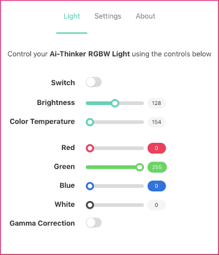

The LED's in your Ai-Thinker LED RGBW light work in a linear way, that if you set its level to the maximum it will produce light with the maximum intensity. Likewise, if you set it to 50%, it will produce light with half intensity. Unfortunately, our eyes don't perceive light in a linear way.

To compensate for this, a process called Gamma Correction can be applied to the LED's light intensity. The correction will make the light's intensity match better how our eyes perceive the intensity of the LED's.

The AiLight firmware contains an option to apply Gamma Correction to your Ai-Thinker LED RGBW light. You can simply enable or disable this option in the 'Light' page of the Web UI.

(Reference: <https://en.wikipedia.org/wiki/Gamma_correction>)
