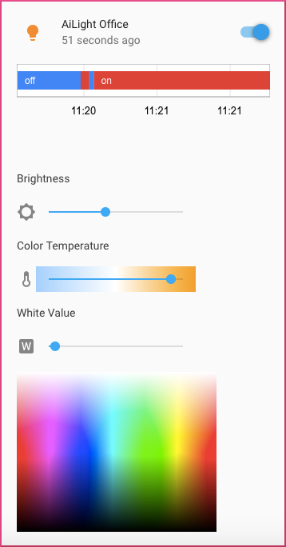

Now that the **AiLight** firmware is uploaded, the next step is making your Ai-Thinker LED RGBW light available in [Home Assistant](https://home-assistant.io). To do that, add the following to your `configuration.yaml` file. (In case you are using the MQTT Discovery option, you can skip this step).

MQTT Broker:

```yaml
mqtt:
  broker: <YOUR_MQTT_SERVER_ADDRESS>
  port: 1883
  client_id: home-assistant
  username: <YOUR_MQTT_USERNAME>
  password: <YOUR_MQTT_PASSWORD>
```
Note: if your MQTT broker is set for anonymous access, you can leave the username and password variables out. Also, change the port number and client_id variables if your situation differs.

Light:
```yaml
light:
  platform: mqtt_json
  name: 'AiLight Office'
  state_topic: '<YOUR_MQTT_STATE_TOPIC>' (e.g. 'AiLight-CC8410')
  command_topic: '<YOUR_MQTT_COMMAND_TOPIC>' (e.g. 'AiLight-CC8410/set')
  color_temp: true
  brightness: true
  rgb: true
  white_value: true
  effect: false
  optimistic: false
```

If you noticed that the state of your Ai-Thinker LED RGBW is not retained after a restart of Home Assistant, make sure to enable this in **AiLight** and Home Assistant, by:
- Add the `retain: true` to your light's configuration in Home Assistant
- Set the parameter `MQTT_RETAIN` to true in your **AiLight** 'config.h' file.

(By default, retaining state is not enabled).


Lastly, add your Ai-Thinker LED RGBW light in a Home Assistant view. For example like this:
```yaml
group:
  default_view:
  lights:
    name: Lights
    entities:
      - light.ailight_office
```
Restart Home Assistant to load the new configuration. If everything goes according to plan, you should see the light appear in your Home Assistant.


