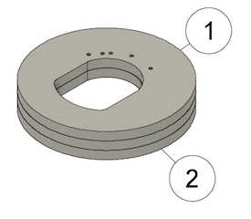

The **AiLight** Jig is designed specifically for the Ai-Thinker LED RGBW light. It allows for uploading custom firmware without soldering any wires to the light’s PCB IO and test contacts. 

The **AiLight** Jig consists of 3 laser cut rings made out of MDF: 2 upper rings [1] with designated holes for pogo pins, and a lower ring [2] acting as the base that fits snug into the light’s aluminum housing.

This kit consists of two parts: the wooden base and a USB to Serial Adapter (based on the CP2102 chipset) with pogo pins pre-soldered.

What do you need?
- MDF wood, ~2.5mm thick (other types of wood are also possible)
- 5 Pogo Pins 
- 1 USB to Serial Adapter board (any type should be fine; based on the CP210x chipset is recommended).
- Glue
- Clamps
- Laser Cutter

Assembly
1. Carefully insert the pogo pins (5 pieces) in the designated holes of the wooden jig. Some force is required to insert as the holes are designed to make the pins fit tightly. The bottom end of each pogo pin should stick out slightly from the lower ring (about 0.5 mm).