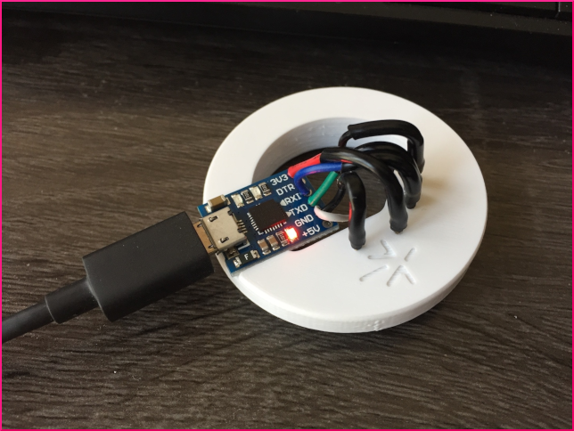

Are you up for making your own AiLight Jig? If you have 'making' skills and access to tools and materials, then follow the instructions below. Don't forget to check out your local maker space if you need support of others!

_The instructions below describe the steps how to make an AiLight Jig out of wood and using a laser cutter. You can also easily make one using a 3D Printer._

***

The **AiLight** Jig is designed specifically for the Ai-Thinker LED RGBW light. It allows for uploading custom firmware without soldering any wires to the light’s PCB IO and test contacts. 

The **AiLight** Jig consists of 3 laser cut rings made out of MDF: 2 upper rings [1] with designated holes for pogo pins, and a lower ring [2] acting as the base that fits snug into the light’s aluminum housing.

## Ingredients
- MDF wood about ~2.5mm thick (other types of wood like plywood is also possible)
- 5 Pogo Pins (P75-B1 Spear Head Diameter 1.02mm Spring Load 100gram) 
- 1 USB to Serial Adapter board (any type should be fine; based on the CP210x chipset is recommended)
- Electric wires about ~5cm long (AWG24 or AWG26)
- (Optional) Heat shrink, about ~10mm for each pogo pin 
- Wood Glue (or equivalent)
- Designs Files:
  - [3D Model](http://a360.co/2rP8FqM) (made with AutoDesk Fusion360)
  - [Lower Element: DXF format](http://a360.co/2szW8da)
  - [Upper Element: DXF format](http://a360.co/2szY5WR)

## Tools
- Laser Cutter
- Wood clamps (or similar)
- Soldering iron
- File
- Sandpaper 

## Construction
1. Cut out the base parts using a laser cutter: 3 pieces in total are needed, 2 upper elements and 1 lower. The lower element needs to be cut out of wood that has a thickness of at least 2.5mm. The thickness of the upper elements can be larger, however the best is to keep it the same as the lower element.
2. Clean up the parts - if necessary - with a file and sandpaper. Check the holes for the pogo pins if they are nice and open. If not, use a 1mm drill bit to make them clean.
3. Glue all the parts together. Insert two pogo pins, so the upper elements are perfectly aligned. Clamp the 3 pieces and wait for the glue to dry.
4. Solder the one end of the 5 pieces of electric wire to a pogo pin. Optionally, use a piece of heat shrink to cover the soldered part.
5. Solder the other end of the wires to the USB/UART adapter. As for the wire colors, you can use the following scheme:
  - 3V3: Red
  - GND: Black
  - RX: Green
  - TX: Blue
  - IO0: Orange/Yellow/White

**Note**: The IO0 connection needs to be tied to GND, so you can solder the IO0 wire and the GND wire together at the USB/UART end.

## Assembly
1. Carefully insert the pogo pins (5 pieces) in the designated holes of the wooden jig. Some force is required to insert as the holes are designed to make the pins fit tightly. The bottom end of each pogo pin should stick out slightly from the lower ring (about 0.5 mm).

2. (Optional). You can attach the USB to UART adapter to the wooden base with a glue gun or a piece of double sided tape. 
To avoid that the adapter might move when inserting/removing the USB cable, you can make a small recess on the top. Either use a cutting knife or file to make the appropriate recess.

Your AiLight Jig is now complete! Next, you can start [[connecting|Connection]] it to your light and [[flash|Flashing-the-Firmware]] the firmware.