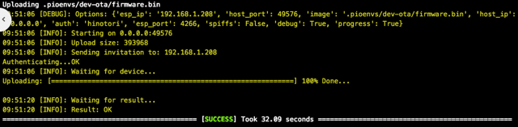
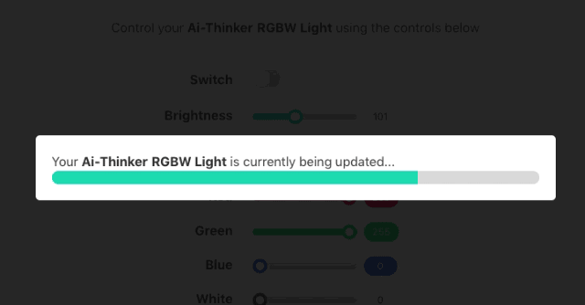

Once you have [[flashed|Flashing-the-Firmware]] your Ai-Thinker LED RGBW light, you can upload newer versions of the **AiLight** firmware via **OTA** (Over The Air) using PlatformIO without your AiLight Jig or USB/UART FTDI (or equivalent) adapter.

To update the **AiLight** firmware via OTA, it is important to make sure that:
- the `upload_port` variable in your `platformio.ini` configuration file matches the 'hostname' value from the Serial Monitor / Web UI.
- the `ota_port` variable in your `platformio.ini` configuration file matches 'OTA_PORT' variable in your `config.h` file.

Now you can start using **OTA** to upload any updates of the firmware over the air by either:
- "Run other target" from the "PlatformIO" menu in Atom, and choose the "PIO Upload dev-ota" or "PIO Upload prod-ota" target, or
- Using the terminal, executing the command

  `platformio run --target upload --environment %environment% --upload-port=%hostname%`

where %environment% is the ota environment ("dev-ota" or "prod-ota") and %hostname% the hostname (or IP address) of your Ai-Thinker LED RGBW light.

_Checkout the [[Building Environments]] page to understand the preconfigured environments._

PlatformIO will start compiling the firmware and initiating the upload:

While the firmware is being uploaded, a progress message is shown on the Web UI:

## Troubleshooting
Sometimes OTA updates fail. This can happen and it is not a problem as the firmware does not get overwritten if the upload fails. Instead of using the hostname of your device, you might want to try using its IP address as that generally performs better.
