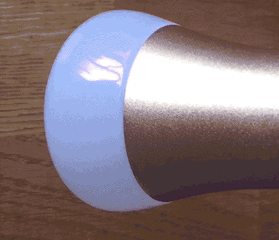

_Since release: **v0.4.0**_

In stead of immediately switching to a new state, gradually transitioning to the desired state (i.e. colours, brightness, etc.) is possible in the **AiLight** firmware as well.

Transitioning will change the light's colours by cross fading from the current to the next state given a specified time:

- If the light is already switched on, the Ai-Thinker LED RGBW light will cross fade from the current colours to the new settings.
- If the light is switched off, the Ai-Thinker LED RGBW light will cross fade from the off (i.e. '0') to the new settings.
- In case the new settings are set to '0' or 'OFF', the Ai-Thinker LED RGBW light will cross fade from the current colours to the off state.



The transition feature can only be used by either sending a specific instruction to the MQTT command topic or using the Home Assistant automation component. It is not possible (yet) to set transition via the Web UI.

## How to use

### 1. Home Assistant
Using Home Assistant's Automation component, you can have your Ai-Thinker LED RGBW light transition to the new settings by a specific trigger and certain conditions. For example, to have your Ai-Thinker LED RGBW light turn on (gradually) 30 minutes before sunset, you can configure Home Assistant in the following way:

``` YAML
automation:
  - alias: 'Switch on the light 30 minutes before sunset'
    initial_state: 'on'
    trigger:
      - platform: sun
        event: sunset
        offset: "-0:30:00"
    action:
      - service: light.turn_on
        data:
          entity_id: light.ailight_office
          color_temp: 350
          transition: 20
```
This will switch on your Ai-Thinker LED RGBW light 30 minutes before sunset, gradually changing it's colour to the colour temperature of ~2857K (= 350 mired) in 20 seconds.

Please check the Home Assistant [Automation](https://home-assistant.io/getting-started/automation/) and [Actions](https://home-assistant.io/docs/automation/action/) documentation pages for more information on how to configure Home Assistant.

### 2. Using MQTT
You can alternatively have your Ai-Thinker LED RGBW light transition to a new state by publishing an MQTT message to your MQTT broker. To do that, simply send a JSON message to the MQTT Command Topic set for your Ai-Thinker LED RGBW light.

Example:
``` JSON
{"state": "ON", "transition":"5", "color": {"r": 255, "g": 255, "b": 0}}
```
Using mosquitto_pub:

`mosquitto_pub -h <your_mqtt_broker> -t <your_ailight_command_topic> -m '{"state": "ON", "transition":"5", "color": {"r": 255, "g": 255, "b": 0}}'`

This will make your Ai-Thinker LED RGBW light switch on, gradually changing it's colour to yellow in 5 seconds.

### 3. Using the REST API
With the embedded REST API you can control your Ai-Thinker LED RGBW light's features like transitioning. Using the cURL client as an example, send the following command to make the light transition to a new state:

`curl -X PATCH
   http://<your_ailight_ip_address_or_hostname_here>/api/light
   -H 'API-Key: <your_api_key_here>'
   -d '{"state": "ON", "transition":"5", "color": {"r": 255, "g": 255, "b": 0}}'
   `

This will make your Ai-Thinker LED RGBW light switch on, gradually changing it's colour to yellow in 5 seconds.

Checkout the [[REST API|REST-API]] Wiki page on how to use the embedded REST API.
